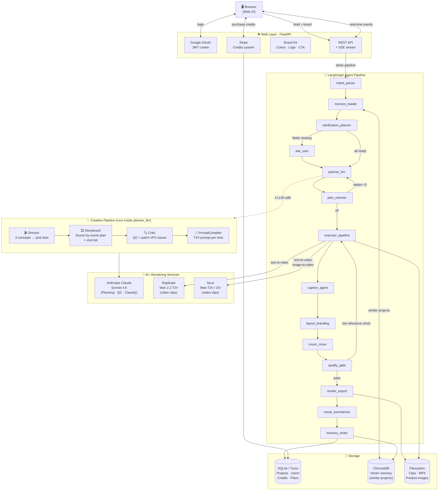

# video-agent-hero — Architecture

> **One-line summary**: User submits a brief → AI plans a storyboard → AI renders each shot as a video clip → FFmpeg assembles the final 9:16 MP4.

---

## System Overview



---

## Pipeline — Node by Node

| # | Node | What it does |
|---|------|-------------|
| 1 | **intent_parser** | Extracts platform, duration, tone from the raw brief |
| 2 | **memory_loader** | Loads brand kit + retrieves similar past projects from ChromaDB |
| 3 | **clarification_planner** | Checks if any required fields are missing (platform / duration / language) |
| 4 | **ask_user** | Interactively collects missing fields *(skipped if all known)* |
| 5 | **planner_llm** | Runs the 4-stage Creative Pipeline (see below) → produces storyboard + T2V prompts |
| 6 | **plan_checker** | Validates shot count, durations, script completeness; loops back up to 3× if needed |
| 7 | **executor_pipeline** | Renders each shot in parallel via Replicate/fal.ai; falls back to PIL gradients if no key |
| 8 | **caption_agent** | Splits script lines into timed subtitle segments |
| 9 | **layout_branding** | Burns captions + brand logo onto clips via PIL / FFmpeg |
| 10 | **music_mixer** | Selects and mixes background music track |
| 11 | **quality_gate** | Checks resolution, duration, bitrate; runs VLM to score each shot's relevance |
| 12 | **render_export** | Final FFmpeg encode → 1080×1920 H.264/AAC MP4 at 30 fps |
| 13 | **result_summarizer** | Compiles summary + deducts credits |
| 14 | **memory_writer** | Saves project to DB + ChromaDB for future similarity search |

---

## Creative Pipeline (inside planner_llm)

```
Brief + Brand Kit
       │
       ▼
  ① Director          — generates 3 distinct creative concepts, picks the best one
       │                 (hook archetype: pov-immersion / problem-contrast / asmr-reveal / micro-story / social-proof)
       ▼
  ② Storyboard        — expands concept into full shot-by-shot plan
       │                 (scene desc, duration, narrative beat, transition language)
       ▼
  ③ Critic            — reviews plan, patches VFX violations & forbidden words via JSON Patch
       │
       ▼
  ④ PromptCompiler    — writes one optimized T2V/I2V prompt per shot
       │
       ▼
   storyboard plan  +  {shot_id: {positive, negative}} prompt dict
```

Each stage is one Claude API call (~20–30 s each, ~3–4 min total).

---

## Graphs (Multiple Execution Modes)

| Graph | Triggered by | Runs |
|-------|-------------|------|
| **Full pipeline** | `POST /api/projects/{id}/run` | All 14 nodes |
| **Plan only** | `POST /api/projects/{id}/plan` | Stops after plan_checker |
| **Execute only** | `POST /api/projects/{id}/execute` | executor_pipeline → render_export |
| **Partial re-render** | `POST /api/projects/{id}/modify` | change_classifier → local shot(s) only, or full replan |
| **Single shot retry** | `POST /api/projects/{id}/rerender-shot` | One shot → caption_agent → render_export |
| **Replan** | Feedback with replan=true | planner_llm → executor_pipeline → render_export |

---

## External Services

| Service | Role | Fallback if missing |
|---------|------|---------------------|
| **Anthropic Claude Sonnet 4.6** | Planning, QC, classification | Mock planner (random plan) |
| **Replicate** (Wan 2.2 T2V) | Text-to-video generation | fal.ai → PIL gradient |
| **fal.ai** (Wan T2V / I2V) | Text-to-video + image-to-video | Replicate → PIL gradient |
| **Stripe** | Credit purchases | Guest mode (free) |
| **Google OAuth** | User login | Guest code access |
| **Turso** | Cloud-synced SQLite | Local SQLite |
| **ChromaDB** | Vector memory (similar projects) | Disabled gracefully |
| **FFmpeg** | Video assembly, encode | Required |

---

## Storage Layout

```
$VAH_DATA_DIR/
├── vah.db                     # SQLite: projects, users, credits, plans, brand kits
├── .env                       # API keys (persisted across HF Spaces restarts)
├── chroma/                    # ChromaDB vector index
├── projects/
│   └── {project_id}/
│       ├── clips/             # Raw + processed video clips per shot
│       └── product.png        # Uploaded product reference image
└── exports/
    └── proj_9x16_*.mp4        # Final output videos (1080×1920, H.264/AAC, 30fps)
```

---

## Tech Stack

```
Web:        FastAPI  ·  SSE  ·  Vanilla JS (single-page)
Agent:      LangGraph  ·  Python 3.11
AI:         Anthropic Claude Sonnet 4.6  ·  LangChain
Video:      Replicate (Wan 2.2)  ·  fal.ai  ·  FFmpeg  ·  PIL
Auth:       Google OAuth 2.0  ·  JWT (httponly cookie)
Billing:    Stripe  ·  Credit system
Storage:    SQLite / Turso  ·  ChromaDB  ·  Local filesystem
Deploy:     HF Spaces (Docker)  ·  Persistent /data volume
```
